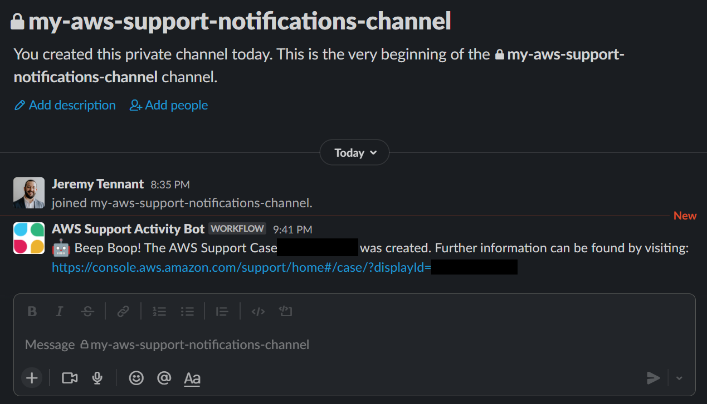

# How to automate the AWS Support API with Amazon EventBridge
The practice of Operational Integration defines how one organization’s people, processes, and tools integrate with the people, processes, and tools of another organization. When certain activities occur within one organization, it may trigger an automated or manual response in another. For example, it’s common for AWS customers to operationally integrate with [AWS Support](https://docs.aws.amazon.com/awssupport/latest/user/event-bridge-support.html) or [AWS Managed Services](https://aws.amazon.com/managed-services/) whenever they need help from AWS.

AWS Support recently announced [Amazon EventBridge support for the AWS Support API](https://docs.aws.amazon.com/awssupport/latest/user/event-bridge-support.html). In the past, customers who wanted to automate a custom response to Support Case activity needed to poll AWS APIs to detect when cases had been created or updated. Now customers can use [Amazon EventBridge](https://aws.amazon.com/eventbridge/) to initiate Event-Driven workflows when activities take place within their AWS account. EventBridge can automatically detect AWS Support activity, as well as initiate an automated response. 

This post will detail how you can embrace an event-driven architecture for common automation scenarios, and interact programmatically with the Support API.

## Solution architecture

This solution is deployed as an AWS CloudFormation stack that deploys the following resources into your AWS account:

1. An EventBridge rule to initiate automated actions when AWS Support Cases are created or updated.
1. An [Amazon Simple Notification Service (Amazon SNS)](http://aws.amazon.com/sns) topic to which the EventBridge rule will publish when support activity has taken place.
1. An [AWS Lambda](http://aws.amazon.com/lambda) function that publishes notifications to an SNS topic.
1. An SNS topic that interested parties can subscribe to when they want to be notified of support activity taking place in their account.
1. A Lambda function that initiates a Slack message to notify a Slack Channel that support activity has taken place.


The solution works as follows:
1. A Support Case is created or updated inside of your account.
1. An Event is put on the EventBridge event bus, and this event is evaluated by EventBridge to determine if there is a matching EventBridge rule.
1. An EventBridge rule is triggered when the event matches the following pattern:

1. The EventBridge rule publishes the event to an SNS Topic.
5. The SNS Topic triggers two Lambda functions, passing a copy of the event to both functions:
 *  The first Lambda function evaluates the event, and based on whether the event is a ‘Create’ or ‘Update’ event, publishes a user-friendly message to an SNS topic. Users who are subscribed to this SNS topic will receive notifications (for example, Email or SMS)
 * The second Lambda function evaluates the event and makes an API call to the Slack Webhook API. Assuming that Slack is configured to receive these events, a message will be posted to a Slack Channel to notify members of the channel of AWS Support activity.

 ## Considerations for production use

The following considerations should be taken into account for use in production:

**Encryption** – It’s best practice to use encryption everywhere. In the sample code provided with this post, the SNS topics aren’t encrypted. When using this solution in production, you should encrypt these topics using [AWS Key Management Service (AWS KMS)](https://aws.amazon.com/kms/).

**At least once delivery** – Amazon SNS provides “at least once” delivery of messages, which means that there’s a chance you might receive multiple notifications. This may not be critical to your organization when integrating with Email or Slack. However, it may present challenges in more complex automations. Consider mechanisms to provide exactly-once delivery based on your use-case.

**Reserved concurrency** – If the AWS account in which this solution is deployed also uses other AWS Lambda functions, then there’s a risk that other Lambda Functions may consume all of the available account capacity, and prevent the Lambda functions in this solution from running. You may need to consider [reserved concurrency](https://docs.aws.amazon.com/lambda/latest/dg/configuration-concurrency.html) if this is applicable to your use case.

**Log retention** – The sample code provided with this post has a hard-coded [Amazon CloudWatch Logs](https://docs.aws.amazon.com/AmazonCloudWatch/latest/logs/WhatIsCloudWatchLogs.html) retention period of seven days. Customers should consider their own data storage retention policies when using it in production. 

## Procedures

### Prerequisites
The following prerequisites are crucial:
* An AWS Account with [AWS Command Line Interface (AWS CLI)](https://aws.amazon.com/cli/) configured.
* The AWS account must be enrolled in Business Support, Enterprise On-Ramp, or Enterprise Support to access the AWS Support API.
* A Slack channel that is configured for advanced workflows using webhooks [based on the documented steps on this page](https://slack.com/intl/en-gb/help/articles/360041352714-Create-more-advanced-workflows-using-webhooks). This post also summarizes those steps in the following section.
* [Git](https://git-scm.com/) to download the sample file source code.

### Step 1: Configure Slack to receive notifications about AWS Support activity

A Slack Webhook is an HTTPS URL that will receive an HTTPS Request whenever Support Activity occurs inside of the AWS Account. When the Webhook receives a properly formatted request, it will pass on the information in the form of a message to a Slack Channel. Slack’s documentation describes how to [create advanced workflows using webhooks](https://slack.com/intl/en-gb/help/articles/360041352714-Create-more-advanced-workflows-using-webhooks). However, the key steps are covered in the following section.

First, if you don’t have a Slack Channel in which you would like AWS Support activity to be published, then create a new Slack channel.


From the channel in which you would like AWS Support activity to be published, open the Slack Workflow Builder.


Select the “Create” button, and give your workflow a name.


Select the “Webhook” option to start this workflow.


Create 3 variables (`caseId`, `caseUrl`, `updateDetails`), each with a Data Type of “Text”. The variables are case sensitive.


Next, add a workflow step to “Send a Message” when the webhook receives a message.


Select a Slack Channel in which you would like to publish AWS Support activity. You can customize the message that will be sent to the channel according to your own requirements, and insert the three variables created earlier (`caseId`, `caseUrl`, and `updateDetails`).


Select the “Publish” option to create the Webhook. After publishing, copy the Slack Webhook URL, which will be similar to:

`https://hooks.slack.com/workflows/<unique id>`


### Step 2: Deploy this solution using the AWS CLI into the us-east-1 region

The AWS Support API is accessible via us-east-1 endpoint. Therefore, this solution must be deployed in us-east-1.


```shell
# Clone the Git Repository
git clone https://github.com/aws-samples/aws-support-case-activity-notifier.git
# Change Directory into the repository
cd ./aws-support-case-activity-notifier
# Use the AWS CLI to deploy the CloudFormation template
aws cloudformation deploy \
--template-file template.yml \
--stack-name SupportCaseNotifier \
--capabilities CAPABILITY_IAM \
--region us-east-1 \
--parameter-overrides SlackWebhookURL=https://hooks.slack.com/workflows/replaceme
```

### Step 3: Subscribe an email address to the SNS topic that provides case update notifications

After your CloudFormation stack has been deployed, navigate to the Amazon SNS console, and select the topic containing the name “EndUserSubscriptionToipic”.


Create a subscription to this topic.


Select the “Email” Protocol, and enter a destination email address that you would like to notify of AWS Support Case activity.


Check your email, as you must confirm the subscription by selecting the provided link before continuing.


### Step 4: Create a test AWS Support Case to verify that the solution has been implemented

Using the AWS Console, AWS CLI, or APIs, create a new AWS Support Case. For test cases, use the subject `TEST CASE-Please ignore`.


After creating the case, you will receive a notification in your Slack channel that a support case was created.




Furthermore, you’ll receive an email notification from the SNS topic to which you subscribed.


## Cleanup

When you’re done, you can clean-up the AWS Resources that were deployed by executing the following commands with the AWS CLI:

```shell
aws cloudformation delete-stack --stack-name SupportCaseNotifier 
```

## Conclusion
In this post, I’ve provided a solution that uses EventBridge to trigger one or more Lambda functions whenever support activity occurs within your AWS account. You can also extend this sample code to create a more advanced automation that meets your own custom requirements.

In addition, AWS provides the [AWS Service Management Connector for Jira Service Management](https://docs.aws.amazon.com/servicecatalog/latest/adminguide/integrations-jiraservicedesk.html) and [AWS Service Management Connector for ServiceNow](https://docs.aws.amazon.com/servicecatalog/latest/adminguide/integrations-servicenow.html) for customers who would prefer a prescriptive solution to integrate with AWS Support and AWS Managed Services.

Happy building!

---

## Security

See [CONTRIBUTING](CONTRIBUTING.md#security-issue-notifications) for more information.

## License

This library is licensed under the MIT-0 License. See the LICENSE file.